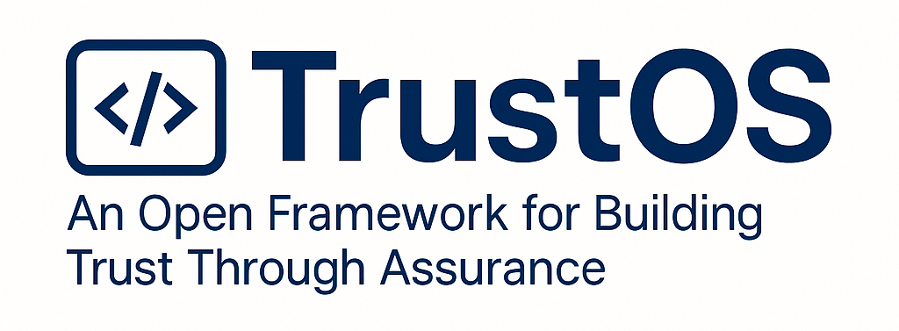

# Welcome!

This repository contains the core modules, patterns, tools, and principles behind TrustOS — a modular, community-driven operating system for modern assurance and control design. This framework is created by assurance practitioners for audit practitioners.

---

## 📚 Documentation Index

### 🔹 [MANIFESTO.md](MANIFESTO.md)
> The philosophical foundation of TrustOS. Why we built it, who it's for, and what we believe about trust and assurance.

### 🔹 [GOVERNANCE.md](GOVERNANCE.md)
> Our open contribution model, roles (steward, contributors, maintainers), and decision-making process.

### 🔹 [CONTRIBUTING.md](CONTRIBUTING.md)
> Guidelines for contributing new modules, patterns, translations, and improvements to the project.

### 🔹 [BRAND_USAGE.md](BRAND_USAGE.md)
> How to use the TrustOS name and logo appropriately. What requires permission and what doesn’t.

### 🔹 [STRUCTURE.md](STRUCTURE.md)
> The architecture of TrustOS — including Core Principles, Functional Modules, and Practice Patterns. Inspired by systems engineering and open-source modularity.

---

## Community Use & Attribution

**TrustOS** is a community-driven, open framework. The name, logo, and associated visuals may be used freely to refer to the project, provided they are not used in a way that suggests official endorsement, partnership, or certification **without prior permission**.

We encourage forks, adaptations, and creative reuse of our resources—just give credit where it’s due:

> “Built on the TrustOS open framework”  
> [https://github.com/audit-brands/trustos](https://github.com/audit-brands/trustos)

If you’re building something exciting using TrustOS, we’d love to hear about it!

**Trust is a system. TrustOS is how we build it.**
