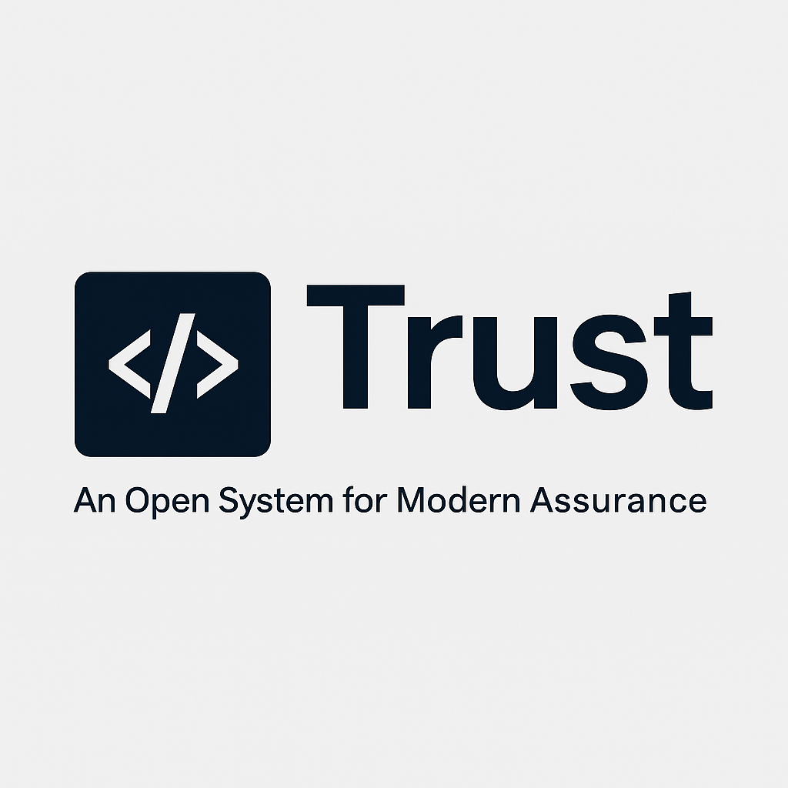

# Trust: An Open System for Modern Assurance

---

Trust is a modular, open-source framework for building trust through modern assurance. It combines control design, system feedback, and stakeholder outcomes that go beyond compliance. This repository contains the core modules, patterns, tools, and the principles behind Trust — a community-driven system for modern assurance and control design. This framework is created by assurance practitioners for audit practitioners.

---

## Putting the Framework into Practice: The `trust-cli` Engine

While the Trust Framework provides the core principles and modular content for a new approach to assurance, the **`trust-cli`** is its official command-line engine. It's the reference implementation that brings the framework to life.

The `trust-cli` is a privacy-focused, local-first AI assistant designed to help practitioners:
*   **Scaffold** new audit engagements based on framework standards.
*   **Integrate** and customize `patterns` and `modules` for specific tasks.
*   **Automate** evidence collection and analysis.
*   **Generate** modern, data-driven reports.

To move from theory to practice, we highly recommend you explore the **[trust-cli repository](https://github.com/audit-brands/trust-cli)**.

---

## 🔧 What's Inside

**Trust Framework**: Principles, modules, and patterns for trust-driven assurance
**Technical Tools**: Local-first implementations including the trust-cli AI assistant

---

## 📐 Repository Structure

| Folder        | Contents |
|---------------|----------|
| `/core/`      | Foundational principles including the [Manifesto](core/MANIFESTO.md), [Governance](core/GOVERNANCE.md), [Brand Usage](core/BRAND_USAGE.md), and [Contribution Guidelines](core/CONTRIBUTING.md) |
| `/modules/`   | Functional assurance modules, starting with [Control Design & Maturity 2.0](modules/control_design_maturity/control_design_maturity.md) |
| `/patterns/`  | Practice-based assurance patterns (coming soon) with YAML metadata, audit logic, and KPIs |
| `/tools/`     | Technical tools that implement Trust principles, including the [trust-cli](tools/trust-cli/) local-first AI CLI |
| `/assets/`    | Logos, infographics, and supporting visuals |
| Root files    | Project [Blueprint](blueprint.md) and [STRUCTURE.md](STRUCTURE.md) overview for contributors |

---

## 📘 Key References

### 🧭 [MANIFESTO.md](core/MANIFESTO.md)
> Vision and philosophy for building trust in adaptive systems.

### ⚙️ [control_design_maturity.md](modules/control_design_maturity.md)
> Control Maturity 2.0, cybernetic controls, improvement checklist and templates.

### 🗺️ [blueprint.md](blueprint.md)
> The long-term roadmap, three-layer architecture, and design principles of Trust.

---

## 🚀 How to Contribute

- Start with [CONTRIBUTING.md](core/CONTRIBUTING.md)
- Submit new modules or practice patterns
- Translate resources or share real-world examples
- Open an issue or pull request to collaborate

---

## 🌱 Attribution & Community Use

**Trust: An Open System for Modern Assurance** is a community-driven, open framework. The name, logo, and associated visuals may be used freely to refer to the project, provided they are not used in a way that suggests official endorsement, partnership, or certification **without prior permission**.

We encourage forks, adaptations, and creative reuse of our resources—just give credit where it's due:

> "Built on the Trust open framework"
> [https://github.com/audit-brands/trust-framework](https://github.com/audit-brands/trust-framework)

If you're building something exciting using Trust, we'd love to hear about it!

**Trust: An Open System for Modern Assurance**